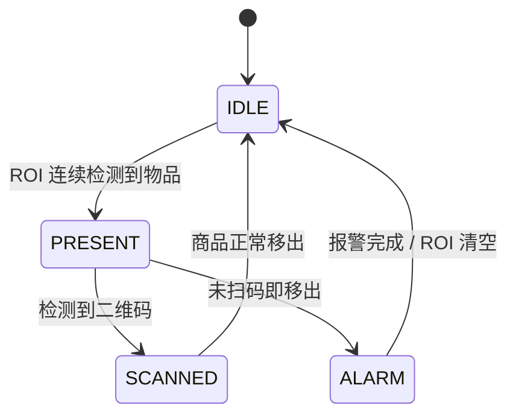
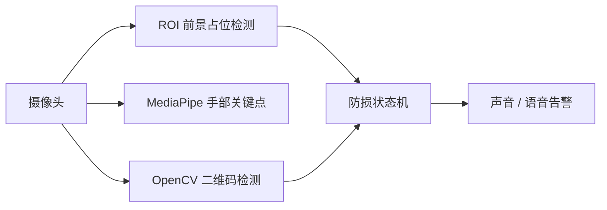

# LPRecognition

基于 OpenCV 和 MediaPipe 的商品防损识别 POC。程序从摄像头读取实时画面，在用户选定的托盘 ROI 中判断物品进入/移出，结合二维码检测模拟“已扫码”状态；物品未扫码即移出时触发告警。

## 功能

- 实时摄像头画面与可交互 ROI
- 基于背景建模的物品占位检测
- MediaPipe 手部 21 关键点、骨架和左右手标注
- OpenCV 二维码检测
- `IDLE -> PRESENT -> SCANNED/ALARM` 状态机
- macOS 蜂鸣声与语音告警

## 状态流程





## 环境

- Python 3.9+
- macOS（AVFoundation、`afplay`、`say` 和 `osascript`）
- OpenCV、NumPy、MediaPipe

```bash
uv sync
# 或：pip install mediapipe numpy opencv-python
```

手部检测需要 `models/hand_landmarker.task`（模型未入库）。未准备模型时，可在 `poc_lossprevention.py` 中将 `ENABLE_HANDS` 设为 `False`。

## 运行

```bash
# 检查摄像头后端和索引
uv run python camera_check.py

# 启动防损 POC
uv run python poc_lossprevention.py
```

首帧拖拽选择托盘区域，按回车/空格确认；运行时按 `r` 重选 ROI，按 `q` 退出。

## 参数与限制

摄像头索引、前景面积阈值、进入/移出连续帧数和报警冷却时间位于 `poc_lossprevention.py` 顶部，更换现场后应重新标定。该项目是验证流程的 POC，默认假设 ROI 一次只有一件商品，不应直接作为生产级防损系统。
